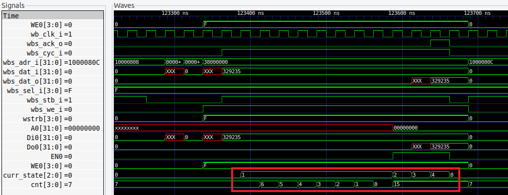
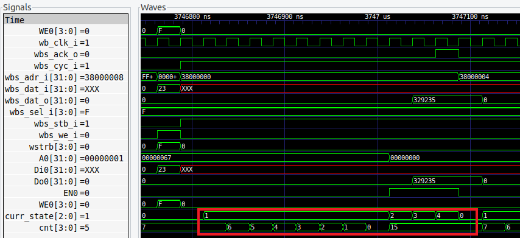

# SOC_LAB4-1: Execute FIR code in user BRAM
## Simulation for FIR
```sh
cd ~/testbench/counter_la_fir
source run_clean
source run_sim
```
## Waveforms
- The circled part shows the FSM states and the FSM delay counter
### Write from Wishbone to BRAM

### Read from BRAM to Wishbone

